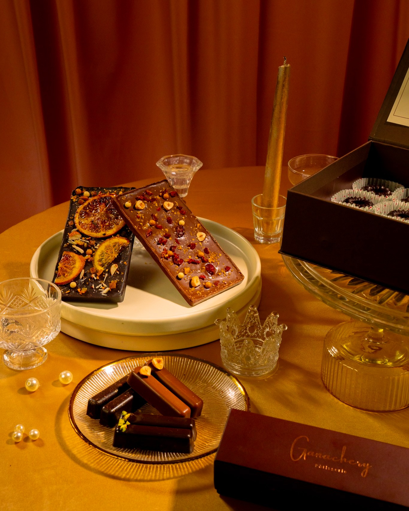

# Ganachery Pâtisserie — Artisanal Chocolates & Premium Dates



**The Ganachery** is an artisanal dessert boutique based in Dhaka, Bangladesh. Established in 2020, we specialize in handcrafted gourmet chocolates, premium stuffed Medjool dates, and luxury gift boxes designed for life's most cherished moments.

## ✦ The Brand Story
Born from a passion for fine confectionery, The Ganachery blends European-grade craftsmanship with local Bangladeshi soul. Every truffle is hand-rolled, and every date is individually stuffed, creating "edible sentiments" for weddings, corporate gifting, and seasonal celebrations.

## ✦ Key Collections
- **Artisanal Truffles:** Handmade with Belgian couverture in flavors like Hazelnut Praline and Dark Chocolate.
- **Stuffed Medjool Dates:** Large, premium dates stuffed with Hazelnut Praline, Gur (Jaggery), and Walnut.
- **Seasonal Specials:** Exclusive Ramadan and Eid collections featuring festive assortments.
- **Pâtisserie:** Signature baked goods including our Basque Burnt Cheesecake and Timeless Fruit Cake.

## ✦ Project Overview
This repository contains the official web platform for The Ganachery, designed with a premium, luxurious aesthetic to reflect the brand's commitment to elegance.

### Tech Stack
- **Core:** HTML5, Vanilla JavaScript
- **Styling:** Custom CSS3 with a focus on rich typography and smooth animations.
- **Build Tool:** Vite
- **Animations:** AOS (Animate on Scroll) & GSAP

## ✦ Development
To run this project locally:

1. Clone the repository:
   ```bash
   git clone https://github.com/Izazzubayer/Ganachery.git
   ```
2. Install dependencies:
   ```bash
   npm install
   ```
3. Start the development server:
   ```bash
   npm run dev
   ```

---
*Designed & Developed by [Pixel Mango](https://github.com/Izazzubayer)*
